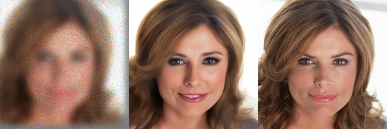
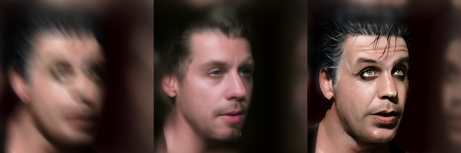
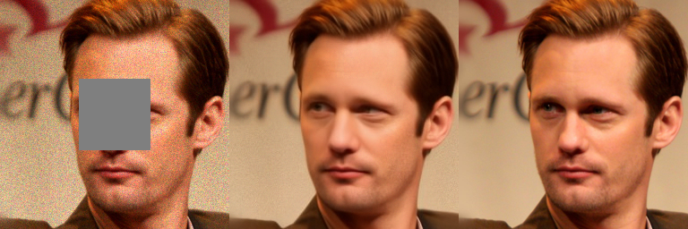
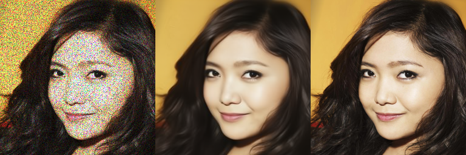
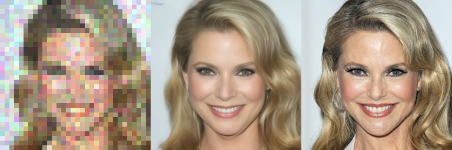

# Blind Image Restoration via Fast Diffusion Inversion (BIRD)

## Environment 
```
pip install numpy torch blobfile tqdm pyYaml pillow    
```

## Pre-Trained Models

For face restoration, download the pretrained [model](https://drive.google.com/file/d/1qMs7tNGV3tkOZNKH5L130dkwsmobEJdh/view?usp=sharing) from and put it into ```checkpoints/```.


## Blind Deblurring

```
python blind_deblurring.py    
```


## Non-uniform Deblurring

```
python non_uniform_deblurring.py    
```


## Inpainting

```
python inpainting.py    
```



## Denoising

```
python denoising.py    
```


## Superresolution

```
python super_resolution.py    
```



